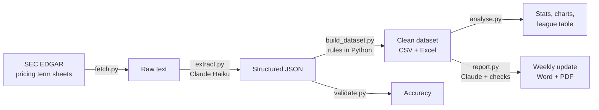
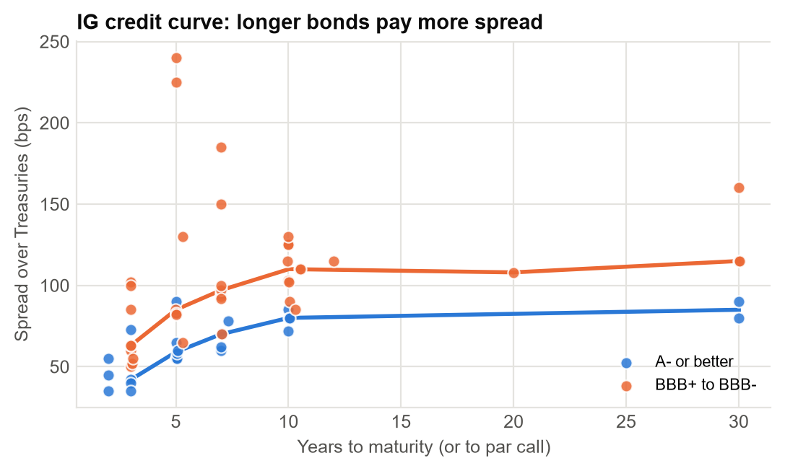
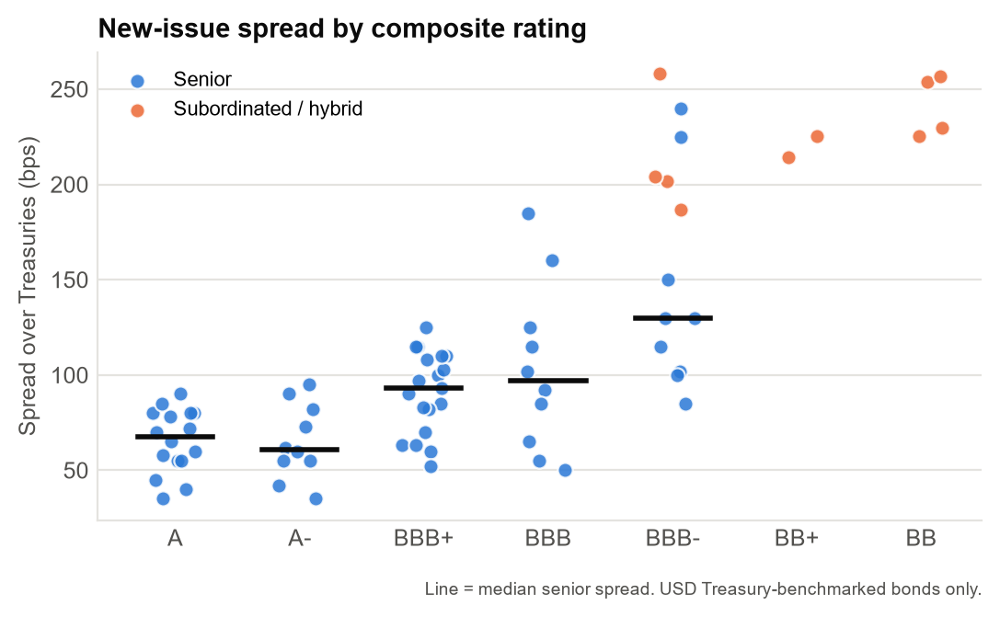

# AI New-Issue Bond Tracker

Turns public bond pricing term sheets into a structured dataset, market analysis and a one-page **Weekly New Issue Market Update**, automating a routine part of a Global Capital Markets analyst's week.

**[View the latest weekly update (PDF)](output/reports/weekly_update_2026-09-22.pdf)**

---

## The problem

When a company prices a new bond, the syndicate desk circulates a *pricing term sheet*: size, coupon, maturity, spread to benchmark, ratings, bookrunners. Tracking these by hand across dozens of deals a week, in inconsistent formats, is slow and error-prone. Yet it is exactly the data a desk needs to see where the market is pricing.

## What it does



| Stage | Script | What happens |
|---|---|---|
| 1. Fetch | `fetch.py` | Pulls new pricing term sheets (form FWP) from the SEC's public API. Skips filings already seen and removes duplicate copies filed by co-issuers and guarantors. |
| 2. Extract | `extract.py` | Claude reads each document and fills a strict JSON schema: issuer, ratings, bookrunners and one entry per bond (tranche). Non-bond filings (equity, preferreds, convertibles) are identified and excluded. |
| 3. Dataset | `build_dataset.py` | Python applies the finance rules: composite rating, IG vs HY, tenor to par call, USD-equivalent size, benchmark tagging, duplicate removal, sanity flags. |
| 4. Validate | `validate.py` | Automatic grounding check on every value, plus a manual spot check on a random sample. |
| 5. Analyse | `analyse.py` | Summary statistics, four charts and a bookrunner league table. |
| 6. Report | `report.py` | One-page weekly update. Python computes every figure; Claude writes the commentary, which is then checked against those figures. |

## Design principles

**The model reads; the code calculates.** Claude only copies what a document states, with `null` for anything missing rather than a guess. Everything that follows a rule (tenor, investment grade classification, currency conversion, spread comparisons) is deterministic Python, so it is consistent and auditable.

**Structured output, not free text.** Extraction uses tool use with a forced JSON schema, so every response has exactly the expected fields and types, with fixed lists for fields like seniority.

**Check the model, don't trust it.** Every extracted number is traced back to its source filing, and every number in the report commentary is checked against the computed figures before the document is saved.

**Low cost by design.** Claude Haiku 4.5 (the lowest-cost current model), a character cap per document, and a cache so no filing is ever sent twice. Token usage is logged per file.

## Results (25 Aug to 22 Sep 2026)

| | |
|---|---|
| Filings processed | 56 (after removing 21 duplicate co-issuer copies) |
| Excluded as not bonds | 4 (2 preferred stock, 1 equity, 1 convertible), all correctly identified |
| Bonds extracted | 95, from 46 deals |
| Volume | $82.5bn equivalent (USD, EUR, GBP) |
| Extraction cost | $0.48 in total, measured from token logs |

**Market findings**

- **Credit curve:** median senior IG spreads rise with tenor, from +55bp (1 to 3y) through +82bp (5y) and +103bp (10y) to +115bp (30y+). BBB issuers price consistently wide of A-rated issuers at every tenor.
- **Subordination premium:** in the BBB- bucket, hybrid and subordinated bonds priced roughly 60 to 130bp wide of the senior median (+130bp).
- **Mix:** investment grade was 91% of volume, and Financials the largest sector ($32bn).
- **Bookrunners:** BofA, Citi, J.P. Morgan and Morgan Stanley led the league table, with each joint bookrunner credited an equal share of deal volume.

<p>


</p>

## Accuracy

Two complementary checks, because each catches errors the other can't.

| Check | Scope | Result |
|---|---|---|
| **Grounding** (automatic) | Every extracted number, date and rating searched for in its source filing | **98.1%** of 771 values found in the source |
| **Spot check** (manual) | 8 randomly sampled deals (fixed seed 42), key fields verified against the exact source line | **100%** of 122 values correct |

Grounding proves values weren't invented, but it can't tell whether a real number came from the right place (a make-whole call's "T+15" is in the document too). The spot check covers that, with each value shown next to the line it came from. The spot check was done with the model's answer visible, so it is manual verification rather than blind labelling; 8 deals is a small sample, and the result should be read with that in mind.

## Limitations

- **Coverage:** SEC-registered deals only. Most US high yield (144A) and many European deals (Reg S) are never filed publicly, so volumes are a sample of the market, not the market, and high yield is under-represented.
- **FX:** non-USD sizes use a single Federal Reserve H.10 snapshot, not each deal's own date.
- **Sector** is classified by the model; every other field is copied from the filing.
- **Weekly comparisons** use small samples. The report only claims a spread move for a tenor with at least 3 bonds in both periods.
- **Commentary:** the number check stops invented figures, not every misreading. An early version passed a paragraph with real numbers but a wrong interpretation (one 30-year BBB bond described as the curve "widening"). Moving the comparisons into Python and tightening the prompt fixed it, but the output is still a draft for human review.

## Next steps

- **New issue concession:** compare each deal's spread with the issuer's existing bonds in the secondary market, the number a syndicate desk actually negotiates on.
- **Broader data:** add a commercial new-issue feed (e.g. Bloomberg or Dealogic) to cover 144A and European issuance.
- **Order books:** extract book size and oversubscription from issuer press releases as a measure of demand.
- **Scheduling:** run the pipeline automatically every Friday.
- **Model comparison:** measure Haiku against a larger model on the same validation sample to quantify the cost/accuracy trade-off.

## Running it

Requires Python 3.10+, an [Anthropic API key](https://console.anthropic.com) and, for the PDF step, Microsoft Word.

```
python -m venv venv
venv\Scripts\activate            # Windows (Mac/Linux: source venv/bin/activate)
pip install -r requirements.txt
```

Copy `.env.example` to `.env` and add your API key plus a name and email for the SEC (their fair-access policy requires automated requests to identify themselves). Then:

```
python fetch.py --days 30        # download term sheets
python extract.py                # Claude extraction (only new files)
python build_dataset.py          # clean dataset
python validate.py grounding     # automatic accuracy check
python analyse.py                # stats and charts
python report.py                 # weekly update
```

Re-running is safe and cheap: each step only processes what's new.

## Project structure

```
config.py            settings: paths, model, FX rates
fetch.py             Stage 1: SEC EDGAR download
extract.py           Stage 2: Claude extraction to JSON
build_dataset.py     Stage 3: finance rules, CSV + Excel
validate.py          Stage 4: grounding + spot check
analyse.py           Stage 5: stats, charts, league table
report.py            Stage 6: weekly update (Word + PDF)
data/raw/            source filings
data/extracted/      one JSON per filing (frozen outputs used for validation)
data/validation/     spot check sheet and results
output/              dataset, charts, league table, reports
```

---

Built by Nick Dugdale, 2026. Data from SEC EDGAR public filings. Not investment advice.
